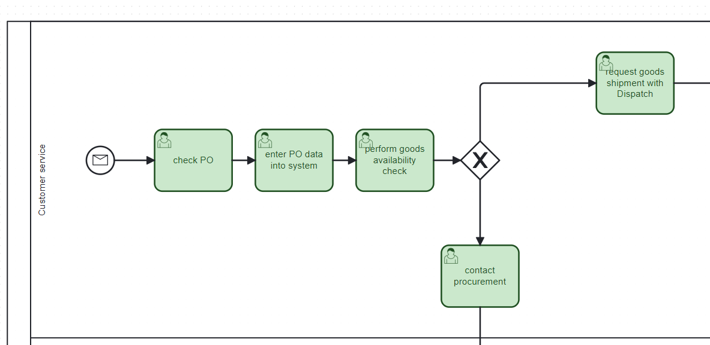
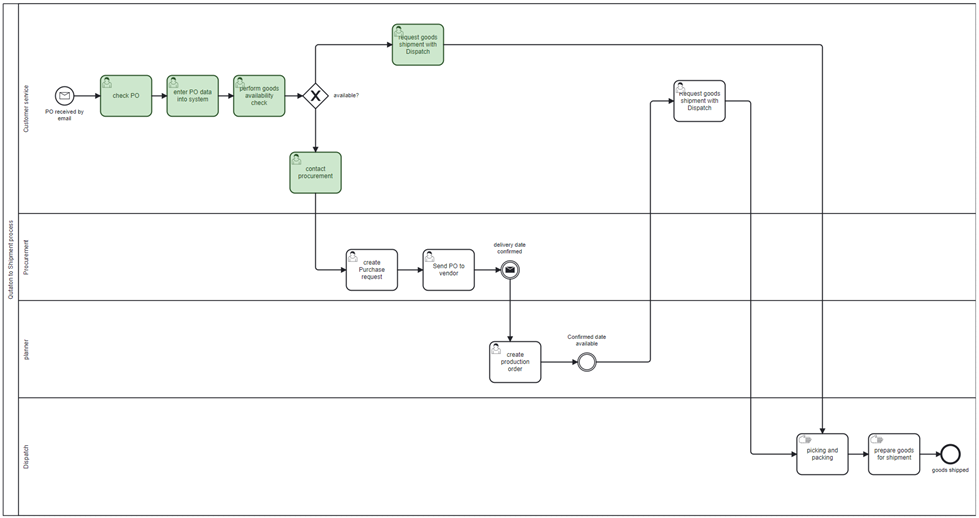
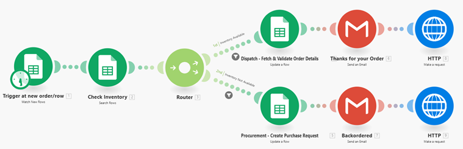
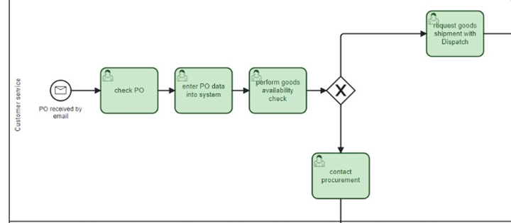
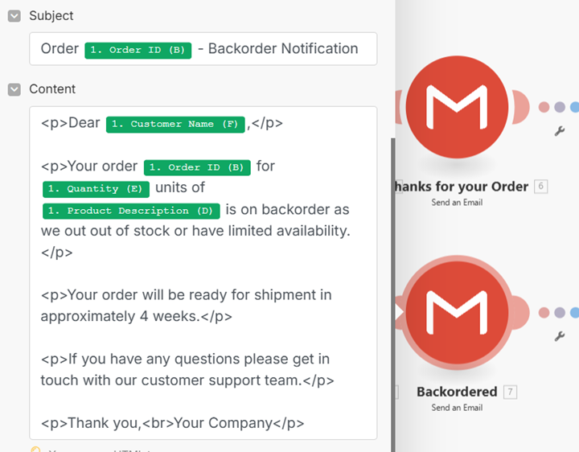
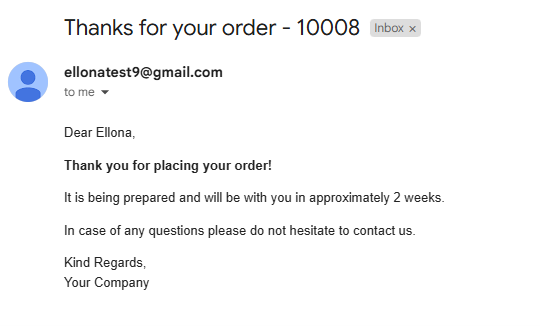
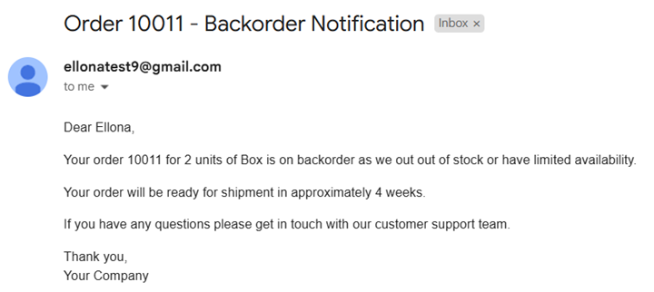
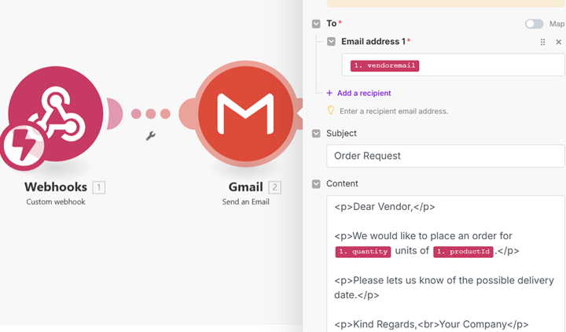
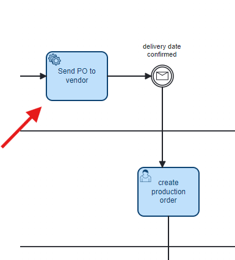

# 🤝 Team 25DIGIBP4: transforming an order-to-shipment process in customer service within F&B machinery industry

# 🧑‍🔧 Team Members

| Name                    | Email                                        |
|-------------------------|----------------------------------------------|
| Ellona Tsap             | ellona.tsap@students.fhnw.ch                 |
| Lukas Janotka           | lukas.janotka@students.fhnw.ch               |
| Patricia Abel           | patricia.abel@students.fhnw.ch               |
| Ramona Steinauer        | ramona.steinauer@students.fhnw.ch	         |

# 💡 Coaches

- Andreas Martin
- Charuta Pande 
- Devid Montecchiari

# 📝 Introduction

Our project is a real-life process within a global food&beverage machinery manufacturer and is a key supporting process to the company´s core sales process of selling food&beverage machinery including its repair and maintenance parts. This order-to-shipment process involves 4 departments and covers the work ranging from processing the purchase order (PO) to preparing and shipping the ordered goods. With over 600 customers and 2500 orderlines processed monthly, the process requires a close followup across all involved departments to fulfill custoemer orders as soon as possible as a main driver behind customer satisfaction.

# 🧩 Challanges of the Process

One of the major challenges is manual work related to the processing of PO and manual checks of goods availability which negatively affects the performance and efficiency. Process also relies on manual communication when checking the availability of orderd goods eespecially at the point when the goods availability check has been performed by cutomer service who, depending on the outcome of this availability check, must inform the relevant colleagues (either Procurement or Dispatch) to carry on with the execution of the process. Such level of manual and back-and-forth communication leads to a substantial amount of time spent on iterative and tidious messaging and ultimately generates time wastes especially if not followed up immediately by customer service or other departments. This might ultimately lead to dissatisfaction of customers and revenue losses.

For a breakdown of specific challenges relative to this process see the below overview. 

- **Fragmented and manual Communication**  
  Coordination between departments depends on manual notifications, leading to delays and errors.

- **Manual goods availability Check**  
  POs are received by email, validated, and entered into the system manually.

- **Inefficient Follow-Up**  
  Manual follow-ups are time-consuming and prone to being overlooked.

- **Lack of Workflow Automation**  
  The absence of automated decision-making especially in terms of checking the availability of ordered goods leads to unnecessary workload and time losses.
  
# 🎯 Goal and Vision

Our goal is to transform the current process by introducing a partial automation that will lead to removing a substantial part of the workflow within Customer Service, specifically the need to carry out goods availability check manually while reducing the chance of possible human erros. By achieving this partial automation, we will save time for parties involved that can be dedicated on continuos improvement elsewhere. Our Vision is not not only deliver a partial automation but also improve customer experience by introducing a way for customers to check the order status or ask for instructions on how to place and order. 

# 📦 AS-IS Process
* https://github.com/DigiBP/25DIGIBP4/blob/main/order_to_shipping_as-is_23_05.bpmn
*  [As-Is BPMN Model – Order to Shipping](As-Is%20Process/order_to_shipping_as-is_23_05.bpmn)

This order-to-shipping process can be broken down into two main parts: (1) processing incoming POs and performing a goods availability (see tasks highlighted in green) and (2) preparing goods for shipment. The first part involves several user tasks within customer service all of which involve non-automated workflow and manual communication. First, an incoming PO is processed retreived manually from a mailbox and PO data entered into the system. after this, customer service manually checks the goods availability which is done by looking up the ordered goods in a stock database and depending on the result, customer service notifies the respective colleague to proceed with the process. If goods are available, Dispatch is notified to prepare the goods for shipment. If goods are not available, customer service notifies procurement to purchase the missing goods. (for both paths see "token videos" below). Such manual availability check and communication is tidious and leads to time wastes in the process which is further excacerbated by loose follow-ups further down the process by other process participants. 

**Roles involved in the process**:

**Internal**
- Customer Service (CS): handles the incoming PO including the check of availability of ordered goods and informs other process participants of the outcome
- Procurement: involved in procuring ordered items which are out-of-stock
- Planner: involved in planning the production of out-of-stock items
- Dispatch: performs warehouse jobs (picking and packing) in preparation to shipping goods

**External**:
- Customer (interaction with customers not modelled)
- Vendor (interaction with vendors not modelled)
  
## 📋 Process Description

| Process Step | Description                        | Comments                                                                                                                                                     | Lane                            |
|--------------|------------------------------------|--------------------------------------------------------------------------------------------------------------------------------------------------------------|---------------------------------|
| 1 | Receipt and processing of PO       | PO is received by email PO is validated and entered into system manually                                                                                  | Customer Service                |
| 2            | Goods availability check           | Manual availability check is performed. Order item quantity is checked for availability in Stock database. If order item in stock, CS informs Dispatch to request the preparation of order for shipping. If order item is out of stock, CS informs Procurement to purchase missing components. | Customer Service (green tasks) |
| 3            | Purchase of missing order items    | Procurement creates a purchase request and when the delivery date is confirmed by the vendor, procurement notifies a planner to plan the production         | Procurement                     |
| 4            | Planning of production of purchased goods                            | Create a production order based on the delivery timeline.                                                                                                    | Planner                         |
| 5            | Missing order items are planned in for production | As soon as the delivery date from vendor is available, Customer Service is notified and informs Dispatch                                         | Customer Service                |
| 6            | Picking and packing                | Goods are prepared for shipment.                                                                                                                             | Dispatch                        |

**Overview of full as-is process**

📹 [Watch the process video Camunda Token - goods available](as-is%20Route%201.mp4)
📹 [Watch the process video Camunda Token - goods not available](as-is%20Route%202.mp4)

  
# TO-BE Process

Technologies Used

| Component                    | Purpose                                        |
|-------------------------|----------------------------------------------|
| Camunda 7            |Modeling the business process |
| BPMN 2.0       |Used Modeling-Language            |
| Make                |Used to automate tasks using different Modules |
| Voiceflow             |Used to design and deploy the conversational interface|

# Google Form 
Our Order to Ship process starts when an order is entered into the Google form (note: the process can not be started manually in Camunda Engine! – which is as expected). As soon as the order has been submitted via google form, the tasks appear in Camunda Engine and may then be completed.

**Links**:
Google Form: https://docs.google.com/forms/d/e/1FAIpQLSeRJk72AsnS4mkPVHtKpz_k9PAM2kjObPrT1Gb0I1208mLp5A/viewform 
Response Sheet: https://docs.google.com/spreadsheets/d/1gB6kCeueMDYXXfVU8TTvKkFgIYxz8RYR0I0wL8L1RyQ/edit?usp=sharing 
Inventory Sheet: https://docs.google.com/spreadsheets/d/1YS6Ev_YT5LyQp5M6MQcl2YjBbLnjlQEp5IqUemB4uAU/edit?gid=0#gid=0 

# Make Scenario 1

The created Make Scenario automates all user tasks (below in green) from customer service and is able to make manual user tasks obsolet.
It takes over the following tasks:

-	Retrieve/check PO from an email
-	enter PO data into the system manually
-	perform Goods Availability check 
-	request goods shipment with Dispatch
AND
-	contact procurement to backorder and out of stock item
  

To create the Scenario, the following Modules have been used:

| Module                    | Purpose                                        | Description |
|-------------------------|----------------------------------------------|------------------|
| Google Sheets          |Watch Rows |Triggers with each new order and starts Camunda Process once an order is entered via Google form
| Google Sheets      |Search Rows           |Checks inventory based on Product ID|
| Router         |    Checks if stock is available or not         |Will direct to the corresponding route |
| Update a Row     | Updates Order Status in Google Sheets  |Shows that the order is either with Dispatch or Procurement |
| Gmail |Send Email     |Sends either a "thank you for your order" email or a notification that the item is currently out of stock and delivery will take longer as it will be re-ordered |
| HTTP Module | Camunda Integration | https://digibp.engine.martinlab.science/engine-rest/process-definition/key/Process_0ad1ggy/tenant-id/25DIGIBP29/start |

# Make Scenario 2

The second Make Scenario has been created  to replace another manual task and is automatically triggered after the User Task "Purchase Request" when stock is unavailable.
It creates and sends a new purchase order to vendor via email.

# 💬 Voiceflow Chatbot – Digital Customer Support Assistant

As part of the digitalization of the Order-to-Cash process, a chatbot was implemented to handle customer inquiries related to order status. The solution is designed to reduce manual communication, improve response times, and enhance customer satisfaction. The chatbot also guides the customer through inquiries concerning the changing the order, the order process and return inquiries.
The chatbot enables customers to receive real-time answers on their questions by entering a valid order ID. It retrieves order information from Google Sheets databases. The chatbot operates through a voice or text interface and is accessible 24/7.

The benefits of offering a chatbot as a service include the following:
* Reduces manual workload for the Customer Service team
* Delivers consistent, fast, and reliable customer communication
* Enhances process transparency and customer satisfaction
* Easily scalable to cover additional services (e.g., delivery updates, FAQs)

The chatbot is complements the Camunda-driven digital process and MAKE automated process flow by serving as a human-centric interface at the customer touchpoint.

# Process Improvements
What got improved?

- Reduce manual tasks
- Improve customer experience
- Save time for the customer service team
- Enable the team to focus on continuous improvement

The following deliverables are mandatory: 
- Link to GitHub repositories containing: 
    - Modelling artefacts (such as BPMN or DMN) and, if required, other project arte
      facts (such as configuration files, source code, etc.) 
    - Documentation about the project and processes (as GitHub markdown files (e.g., 
      Readme and interlinked .md files)) 
- Link to a running workflow(s) and/or instantiation(s) of a: 
   - Link to start form(s) and/or cloud-based deployment(s) 
- Link to presentation slides
