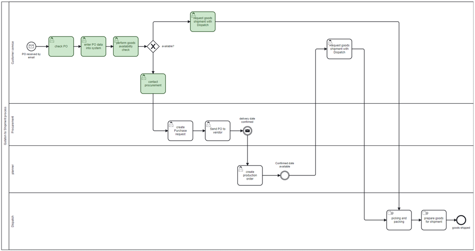

# Team Members

| Name                    | Email                                        |
|-------------------------|----------------------------------------------|
| Ellona Tsap             | ellona.tsap@students.fhnw.ch                 |
| Lukas Janotka           | lukas.janotka@students.fhnw.ch               |
| Patricia Abel           | patricia.abel@students.fhnw.ch               |
| Ramona Steinauer        | ramona.steinauer@students.fhnw.ch	         |

# Coaches

- Andreas Martin
- Charuta Pande 
- Devid Montecchiari

# 🎯 Project Goals

The goal of the assignment is to develop a solution that applies the DigiBP approach to a business process, demonstrating how digital technologies can improve process performance. 

# 📦 AS-IS Process

This order-to-shipment is a key supporting process. It involves 4 departments and covers the work ranging from processing the purchase order (PO) to preparing and shipping the ordered goods. With over 600 customers and 2500 orderlines processed monthly, the process requires a close followup across all involved departments to avoid creating time wastes which might potentially lead to customer disatisfaction.

**Roles involved in the process**:

**Internal**
- Customer Service (CS): handles the incoming PO, the availability of ordered goods and informs other process participants of the outcome
- Procurement: involved in procuring ordered items which are out-of-stock
- Planner: involved in planning the production of out-of-stock items
- Dispatch: performs warehouse jobs (picking and packing) in preparation to shipping goods

**External**:
- Customer
- Vendor (interaction with vendors is not modelled as it´s out of scope of this project)
  
## Process Description

| Process Step | Description                        | Comments                                                                                                                                                     | Lane                            |
|--------------|------------------------------------|--------------------------------------------------------------------------------------------------------------------------------------------------------------|---------------------------------|
| 1            | Receipt and processing of PO       | PO is received by email PO is validated and entered into system manually                                                                                  | Customer Service                |
| 2            | Goods availability check           | Manual availability check is performed. Order item quantity is checked for availability in Stock database. If order item in stock, CS informs Dispatch to request the preparation of order for shipping. If order item is out of stock, CS informs Procurement to purchase missing components. | Customer Service (green tasks) |
| 3            | Purchase of missing order items    | Procurement creates a purchase request and when the delivery date is confirmed by the vendor, procurement notifies a planner to plan the production         | Procurement                     |
| 4            | Planner                            | Create a production order based on the delivery timeline.                                                                                                    | Planner                         |
| 5            | Missing order items are planned in for production | As soon as the delivery date from vendor is available, Customer Service is notified and informs Dispatch                                         | Customer Service                |
| 6            | Picking and packing                | Goods are prepared for shipment.                                                                                                                             | Dispatch                        |

📹 [Watch the process video Camunda Token](as-is%20Route%201.mp4)

# 🧩 Challanges of the Process

One of the major challenges are a manual work relative to processing of PO and performing manual checks of goods availability which negatively affects the performance and efficiency. Process relies on manual communication in checking the availability of orderd goods and especially at the point when a goods availability check is performed, customer service team has to inform the relevant colleagues which is dependent on the result (see tasks marked green). 
Such level of manual coordination leads to a substantial amount of time spent on iterative and tidious messaging and ultimately generates time losses especially if not followed up immediately. This might ultimately lead to dissatisfaction of customers.  

- **Fragmented Communication**  
  Coordination between departments depends on manual notifications, leading to delays and errors.

- **Manual Document Preparation**  
  POs are received by email, validated, and entered into the system manually.

- **Inefficient Goods Availability Check**  
  Manual stock checks are performed, and customer service must inform other departments accordingly.

- **Inefficient Follow-Up**  
  Manual follow-ups are time-consuming and prone to being overlooked.

- **Process Bottlenecks**  
  Delays often occur when missing goods require procurement and production coordination.

- **Lack of Workflow Automation**  
  The absence of automated decision-making and notifications leads to unnecessary workload and time losses.

  
# TO-BE Process

As the company grows, we seek to **reduce the amount of user tasks and manual work** needed to perform them especially the goods availability check. By achieving this partial automation, we will save time for parties invovled that can be dedicated on continuos improvement elsewhere. Our process solution will introduce a pratial automation eliminating the need to check goods manually while also reducing manual communication.

Our Vision is not not only deliver a partial automation but also improve customer experience with the improved process.

We aim to:

- Reduce manual tasks
- Improve customer experience
- Save time for the customer service team
- Enable the team to focus on continuous improvement

Technologies Used

| Component                    | Purpose                                        |
|-------------------------|----------------------------------------------|
| Camunda 7            |Modeling the business process |
| BPMN 2.0       |Used Modeling-Language            |
| DMN         |     see Make        |
| Google Form      |        |
| Google Sheet     |Serves as a database collecting incoming orders as well as an inventory database |
| Post             | 
| Make                |
| Voiceflow             |Used to design and deploy the conversational interface

# Google Form
https://docs.google.com/forms/d/e/1FAIpQLSfrZuLGhWxTEj_86DGCYEw97wCztB8QaVXKZe03wEM6Rq_qEA/viewform
https://docs.google.com/spreadsheets/d/1acwL_7EVOsgsh5U8FepiyN8VsF1C-bmWOzAxlu0-zZ8/edit?gid=0#gid=0

# Make Scenarios

# Email Notification

# 💬 Voiceflow Chatbot – Digital Customer Support Assistant

As part of the digitalization of the Order-to-Cash process, a chatbot was implemented to handle customer inquiries related to order status. The solution is designed to reduce manual communication, improve response times, and enhance customer satisfaction. The chatbot also guides the customer through inquiries concerning the changing the order, the order process and return inquiries.
The chatbot enables customers to receive real-time answers on their questions by entering a valid order ID. It retrieves order information from Google Sheets databases. The chatbot operates through a voice or text interface and is accessible 24/7.

The benefits of offering a chatbot as a service include the following:
* Reduces manual workload for the Customer Service team
* Delivers consistent, fast, and reliable customer communication
* Enhances process transparency and customer satisfaction
* Easily scalable to cover additional services (e.g., delivery updates, FAQs)

The chatbot is complements the Camunda-driven digital process and MAKE automated process flow by serving as a human-centric interface at the customer touchpoint.

# Process Improvements
What got improved?

- Reduce manual tasks
- Improve customer experience
- Save time for the customer service team
- Enable the team to focus on continuous improvement

The following deliverables are mandatory: 
- Link to GitHub repositories containing: 
    - Modelling artefacts (such as BPMN or DMN) and, if required, other project arte
      facts (such as configuration files, source code, etc.) 
    - Documentation about the project and processes (as GitHub markdown files (e.g., 
      Readme and interlinked .md files)) 
- Link to a running workflow(s) and/or instantiation(s) of a: 
   - Link to start form(s) and/or cloud-based deployment(s) 
- Link to presentation slides
