# Team 25DIGIBP4: transforming an order-to-shipment process in customer service within F&B machinery industry

# 🧑‍🔧 Team Members

| Name                    | Email                                        |
|-------------------------|----------------------------------------------|
| Ellona Tsap             | ellona.tsap@students.fhnw.ch                 |
| Lukas Janotka           | lukas.janotka@students.fhnw.ch               |
| Patricia Abel           | patricia.abel@students.fhnw.ch               |
| Ramona Steinauer        | ramona.steinauer@students.fhnw.ch	         |

# 💡 Coaches

- Andreas Martin
- Charuta Pande 
- Devid Montecchiari

# 📝 Introduction

Our project is a real-life process within a global food & beverage machinery manufacturer and is a key supporting process to the company´s core sales process of selling food & beverage machinery including its repair and maintenance parts. This order-to-shipment process involves four departments and covers the work ranging from processing the purchase order (PO) to preparing and shipping the ordered goods. With over 600 customers and 2'500 orderlines processed monthly, the process requires a close followup across all involved departments to fulfill customer orders as soon as possible as a main driver behind customer satisfaction.

# 🧩 Challanges of the Process

One of the major challenges is manual work related to the processing of PO and manual checks of goods availability, which negatively affects the performance and efficiency. The process also relies on manual communication when checking the availability of orderd goods especially at the point when the goods availability check has been performed by cutomer service who, depending on the outcome of this availability check, must inform the relevant colleagues (either Procurement or Dispatch) to carry on with the execution of the process. Such level of manual and back-and-forth communication leads to a substantial amount of time spent on iterative and tidious messaging and ultimately generates time wastes especially if not followed up immediately by customer service or other departments. This might ultimately lead to dissatisfaction of customers and revenue losses.

For a breakdown of specific challenges relative to this process see the below overview. 

- **Fragmented and manual Communication**  
  Coordination between departments depends on manual notifications, leading to delays and errors.

- **Manual goods availability Check**  
  POs are received by email, validated, and entered into the system manually.

- **Inefficient Follow-Up**  
  Manual follow-ups are time-consuming and prone to being overlooked.

- **Lack of Workflow Automation**  
  The absence of automated decision-making especially in terms of checking the availability of ordered goods leads to unnecessary workload and time losses.
  
# 🎯 Goal and Vision

Our goal is to transform the current process by introducing a partial automation that will lead to removing a substantial part of the workflow within Customer Service, specifically the need to carry out goods availability check manually while reducing the chance of possible human erros. By achieving this partial automation, we will save time for parties involved that can be dedicated on continuos improvement elsewhere. Our Vision is to not only deliver a partial automation but also improve customer experience by introducing a way for customers to check the order status or ask for instructions on how to place and order. 

# 📦 AS-IS Process
*  [As-Is BPMN Model – Order to Shipping](As-Is%20Process/order_to_shipping_as-is_23_05.bpmn)

This order-to-shipping process can be broken down into two main parts: processing incoming POs and performing a goods availability (see tasks highlighted in green) and preparing goods for shipment. The first part involves several user tasks within customer service all of which involve non-automated workflow and manual communication. First, an incoming PO is processed by retreiving it manually from a mailbox and entering the PO data into the system. after this, customer service manually checks the goods availability which is done by looking up the ordered goods in a stock database and depending on the result, customer service notifies the respective colleague to proceed with the process. If goods are available, Dispatch is notified to prepare the goods for shipment. If goods are not available, customer service notifies procurement to purchase the missing goods. (for both paths see "token videos" below). Such manual availability check and communication is tidious and leads to time wastes in the process which is further excacerbated by loose follow-ups further down the process by other process participants. 

**Roles involved in the process**:

**Internal**
- Customer Service (CS): handles the incoming PO including the check of availability of ordered goods and informs other process participants of the outcome
- Procurement: involved in procuring ordered items which are out-of-stock
- Planner: involved in planning the production of out-of-stock items
- Dispatch: performs warehouse jobs (picking and packing) in preparation to shipping goods

**External**:
- Customer (interaction with customers not modelled)
- Vendor (interaction with vendors not modelled)
  
## 📋 Summarized Process Description

| Process Step | Description                        | Comments                                                                                                                                                     | Lane                            |
|--------------|------------------------------------|--------------------------------------------------------------------------------------------------------------------------------------------------------------|---------------------------------|
| 1 | Receipt and processing of PO       | PO is received by email PO is validated and entered into system manually                                                                                  | Customer Service                |
| 2            | Goods availability check           | Manual availability check is performed. Order item quantity is checked for availability in Stock database. If order item in stock, CS informs Dispatch to request the preparation of order for shipping. If order item is out of stock, CS informs Procurement to purchase missing components. | Customer Service (green tasks) |
| 3            | Purchase of missing order items    | Procurement creates a purchase request and when the delivery date is confirmed by the vendor, procurement notifies a planner to plan the production         | Procurement                     |
| 4            | Planning of production of purchased goods                            | Create a production order based on the delivery timeline.                                                                                                    | Planner                         |
| 5            | Missing order items are planned in for production | As soon as the delivery date from vendor is available, Customer Service is notified and informs Dispatch                                         | Customer Service                |
| 6            | Picking and packing                | Goods are prepared for shipment.                                                                                                                             | Dispatch                        |

🎥 [As-Is Route 1 Video](https://github.com/DigiBP/25DIGIBP4/blob/main/As-Is%20Process/as-is%20Route%201.mp4)

🎥 [As-Is Route 2 Video](https://github.com/DigiBP/25DIGIBP4/blob/main/As-Is%20Process/as-is%20Route%202.mp4)

  
# ✨ TO-BE Process
The redesigned process focuses on automating and orchestrating the end-to-end order-to-shipping workflow. By leveraging Camunda, Make, and Voiceflow, we have eliminated many manual steps, ensured real-time data flow, and introduced decision automation based on stock availability. This enables seamless collaboration between departments, reduces human errors, and significantly speeds up both vendor handling and customer communication.

**Key Features**
- Automated PO intake via Google Forms with instant trigger to Camunda
- Dynamic stock check through Google Sheets integration
- Smart communication by the creation of automatic emails for order confirmations, backorders and vendor updates
- Rule based decision logic implemented in Make using Routers
- Workflow notification by task assignment alerts to responsible teams in Camunda
- Conversational interface with Voiceflow to support customer communication
- Error prevention by eliminating manual routing through automation and validation steps
- Faster turnaournd by reducing processing and response time to vendors and clients
  

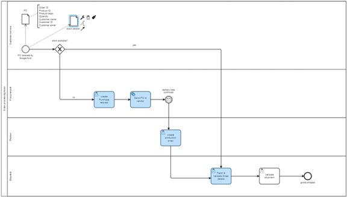

# Google Form 
Our Order to Ship process starts when an order is entered into the Google form (note: the process can not be started manually in Camunda Engine! – which is as expected). As soon as the order has been submitted via google form, the tasks appear in Camunda Engine and may then be completed.

Links:
Google Form: https://docs.google.com/forms/d/e/1FAIpQLSeRJk72AsnS4mkPVHtKpz_k9PAM2kjObPrT1Gb0I1208mLp5A/viewform 
Response Sheet: https://docs.google.com/spreadsheets/d/1gB6kCeueMDYXXfVU8TTvKkFgIYxz8RYR0I0wL8L1RyQ/edit?usp=sharing 
Inventory Sheet: https://docs.google.com/spreadsheets/d/1YS6Ev_YT5LyQp5M6MQcl2YjBbLnjlQEp5IqUemB4uAU/edit?gid=0#gid=0 

# Make Scenario 1

To eliminate manual tasks, increase efficienty and to incorporate workflow automation and automated decision making the first Make Scenario offers a reliable solution:

The created Make Scenario automates all user tasks (below in green) from customer service and is able to make manual user tasks obsolet.
It takes over the following tasks:

-	Retrieve/check PO from an email
-	enter PO data into the system manually
-	perform Goods Availability check 
-	request goods shipment with Dispatch
AND
-	contact procurement to backorder and out of stock item
  

To create the Scenario, the following Modules have been used:

| Module                    | Purpose                                        | Description |
|-------------------------|----------------------------------------------|------------------|
| Google Sheets          |Watch Rows |Triggers with each new order and starts Camunda Process once an order is entered via Google form
| Google Sheets      |Search Rows           |Checks inventory based on Product ID|
| Router         |    Checks if stock is available or not         |Will direct to the corresponding route |
| Update a Row     | Updates Order Status in Google Sheets  |Shows that the order is either with Dispatch or Procurement |
| Gmail |Send Email     |Sends either a "thank you for your order" email or a notification that the item is currently out of stock and delivery will take longer as it will be re-ordered |
| HTTP Module | Camunda Integration | https://digibp.engine.martinlab.science/engine-rest/process-definition/key/Process_0ad1ggy/tenant-id/25DIGIBP29/start |

Example of the auotmated messages created:

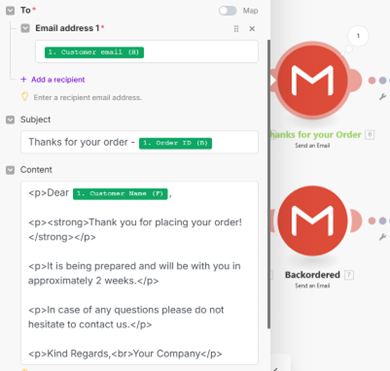

# Make Scenario 2

The second Make Scenario has been created  to replace another manual task and is automatically triggered after the User Task "Purchase Request" when stock is unavailable.

It creates and sends a new purchase order to vendor via email.

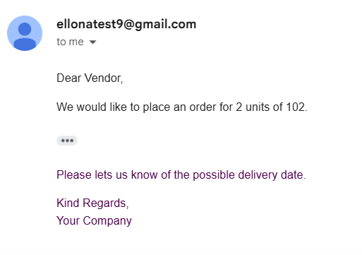

The scenario was created by using a Custom Webhook and the GMail Module (Send Email). 
After the Service Task a Message Intermediate Catch Event was created as the Vendor needs to confirm the delivery date. 

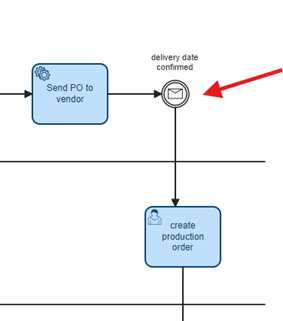

As soon as the vendor replies with a confirmation via email, Postman is used to manually trigger this message even in Camunda to simluate the vendor's confirmation. This is requireed because the process contains a Message Intermediate Catch Event ("delivery date confirmed") that waits for an external signal to proceed. By sending a POST request from Postman to the Camunda Engine, the process continues with the next task: Create Production Order

**Example POST endpoint:**

POST https://digibp.engine.martinlab.science/engine-rest/message

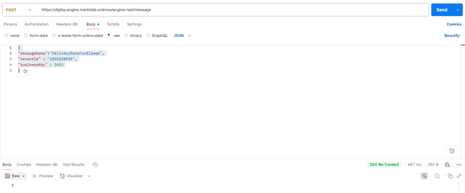

# Recap of the integrated Flow

1. Customer submits PO → Google Form
2. InventoryCheck Make Scenario runs:
   - Checks inventory
   - Updates Google Sheet
   - Notifies customer
   - Starts Camunda process
3. If stock is not available, Camunda waits for delivery confirmation (message event)
4. Vendor receives email → sends delivery date manually
5. Professor triggers message via Postman (token continues in Camunda)

# 💬 Voiceflow Chatbot – Digital Customer Support Assistant

As part of the digitalization of the Order-to-Cash process, a testing chatbot was implemented to handle customer inquiries related to order status. The chatbot modeled in Voiceflow, named Buddy,  will serve as a virtual customer service agent, supporting the Customer Service team in their daily work. Right now the primary objective of the chatbot test version is to strengthen customer acceptance by integrating the chatbot early on the website. The chatbot's main goal will be to make the customer support process more efficient as well as preparing the team for more digital processes to come.

Buddy is an LM agent designed with a comprehensive knowledge base containing detailed information about products and processes. Conversation examples, response guidelines, scenario handling, and company-specific details have been incorporated to ensure high-quality, consistent, and reliable communication with customers.
Currently, Buddy is prepared to handle five distinct workflows, with the focus on the digitalised customer order process. 

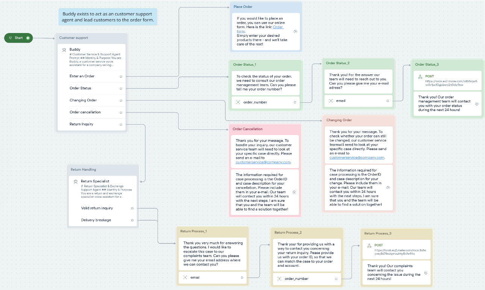

When a customer wishes to place an order or inquire about the ordering process, Buddy triggers a predefined sample text combined with a direct link to the digital order form, initiating the automated customer order process in Make. 

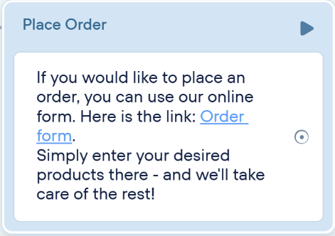

If the customer wants to check their order status, Buddy asks them for their order number and email address and informs the customer that the order management team will follow up within 24 hours. The information gets send into the prepared “Customer Inquiry gSheet” using a POST API via an MAKE Szenario. From the gSheet the order management team can draw the information, assign an responsible person and document the contacting of the customer. However, this template is a first draft and can be refined as soon as the next steps for digitalization of the companies processes are taken.

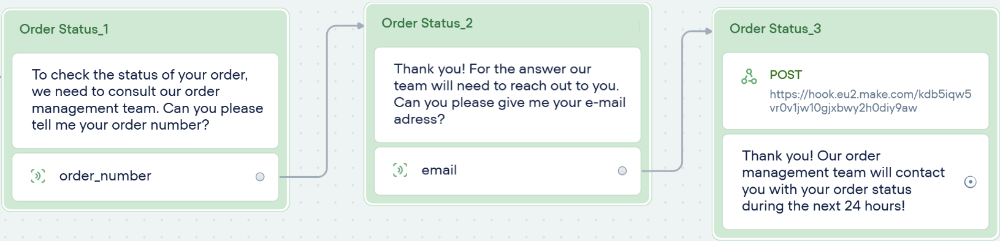
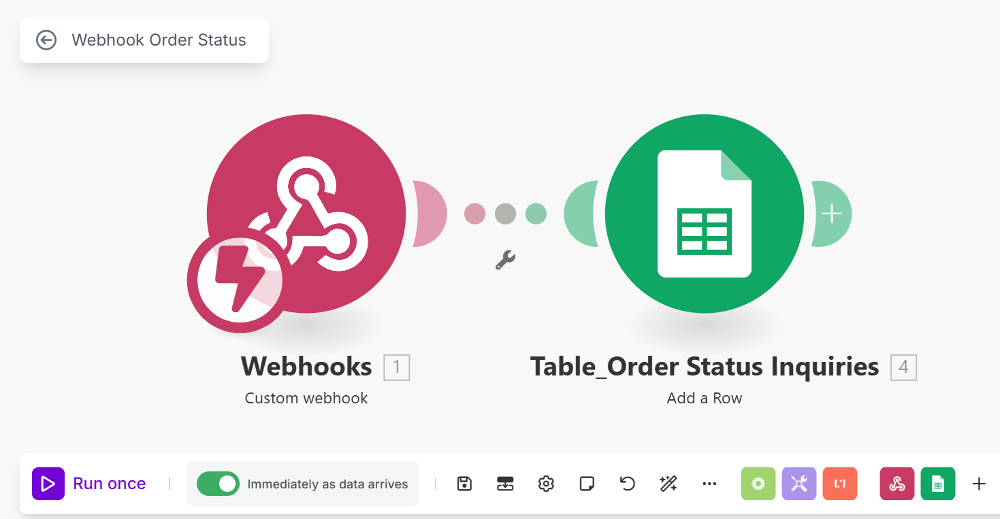
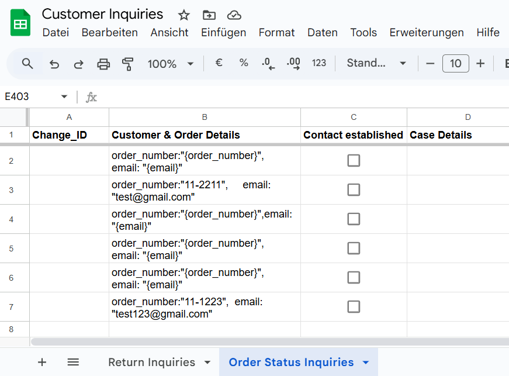

Link Customer Inquiries gSheet: https://docs.google.com/spreadsheets/d/1jipBzAHfP4xg9wYGTxr5Fo2pj5iYP5XjT_rtzxF-e0I/edit?gid=0#gid=0

For order changes, Buddy explains that such changes require direct communication with the customer service team, prompting the customer to send an email with their order ID and details to the specified email address. Similarly, if a customer wants to cancel their order, Buddy instructs them to email the customer service team with their order ID and reason for cancellation, noting that the team will contact them within 24 hours to discuss a solution.

The logic here is that the cancellation of or a change of a confirmed order will require a manual intervention in the workflow. For the start these types of inquiries are intentionally made more cumbersome for the customer by requiring them to get active and write an email. This procedure is intended to curb excessive requests for order cancellation or modification.

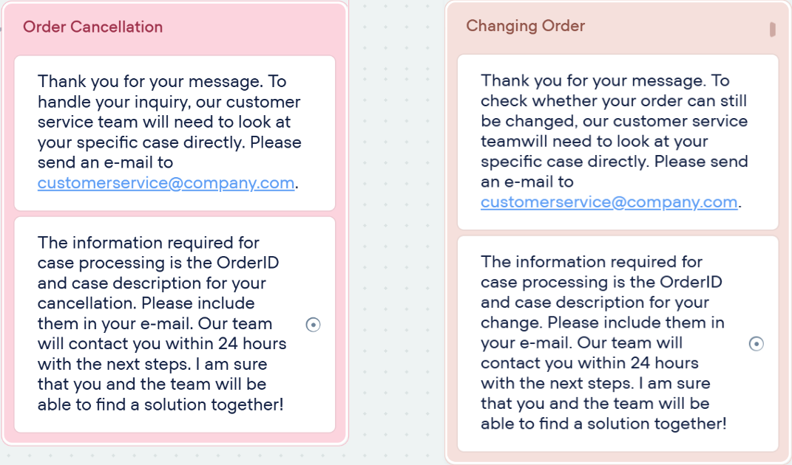

To avoid overwhelming the chatbot’s knowledge base and to maintain agility, a second specialised agent, the Return Specialist, handles return inquiries. This ensures that the chatbots knowledge bases are not getting distracted by too much data and the correct paths are being triggered. In the first rounds of testings only using one agent resulted in getting vague answers or got the chatbot stuck in loops.

The steps to the second agent are being taken when the customer insists on a return of the ordered product. The Return Specialist handles different cases, currently modelled are either valid return inquiries or delivery breakage cases. For both paths, the chatbot thanks the customer for their input, collects the customer’s email address and order number, and then sends the information to the complaints team through a POST request. The customer is informed that the complaints team will reach out within 24 hours. The MAKE workflow is identical to the order status workflow, only differing in the webhook. The inquiry will land on the “Return Inquiry” page of the customer Inquiries gSheet.

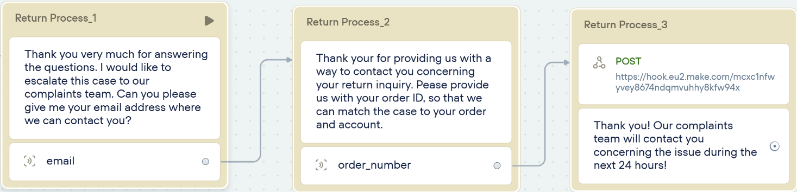

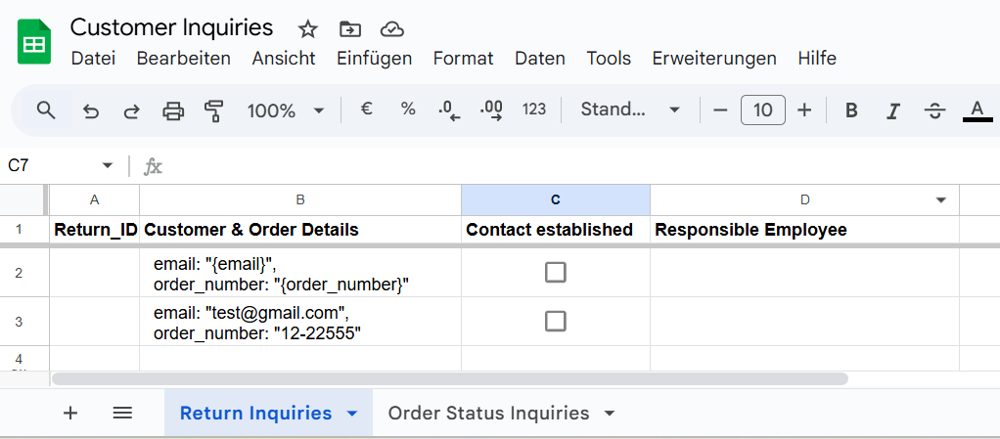

Link Customer Inquiries gSheet: https://docs.google.com/spreadsheets/d/1jipBzAHfP4xg9wYGTxr5Fo2pj5iYP5XjT_rtzxF-e0I/edit?gid=0#gid=0

**Current Limitations and Future Enhancements**

Currently, Buddy may face challenges with highly specific inquiries, such as incorrect order numbers, leading to response loops. As Buddy is still a test model and not yet live, this is acceptable within the project’s scope. 
To mitigate the risk of misinformation, Buddy is designed with restricted pathways, ensuring that only valid paths are triggered and preventing inaccurate responses. Loosening those restrictions and adding more szenarios will make the chatbot easily scalable to cover additional services (e.g., delivery updates, FAQs and more) in the future.

Future updates will focus on refining phrasing and expanding language capabilities. At the moment the chatbot operates in English only when workflows are triggered, but additional languages can be integrated in future updates. 
Moreover, Voiceflow offers the possibility of integrating the chatbot with hotlines to ensure 24/7 availability, thus enhancing customer service beyond typical service hours. 

The chatbot significantly enhances the order process by:
-	Reducing manual communication and workload for Customer Service
-	Providing consistent, fast, and reliable customer communication
-	Seamlessly complementing the automated processes in Camunda and Make

# Process Improvements
In our analysis of the original order-to-shipment process, we identified several key challenges: fragmented communication, manual data handling, inefficient follow-ups, and a lack of automation. These issues led to delays, errors, and inconsistent customer experiences. To address these pain points, we designed and implemented a digitalized and automated solution. Our improved process reduces manual workload, increases transparency, and speeds up response times, all while maintaining flexibility and human oversight where necessary.

| Challenge                    | Solution                                        |
|-------------------------|----------------------------------------------|
| Manual PO checks           |Google Forms + automated trigger |
| Manual stock checks      |Inventory lookup in Google Sheets         |
| Fragemented, delayed and manual communication                |Emails sent automatically via Make |
| Inefficient Follow-Ups  |Responsible Departement gets automated notification in Camunda when new task are available|
| No decision automation                 | Camunda decision based on stock status |
| Process errors             |Eliminates human input at routing points|
| Slow vendor coordination           |Email automatically generated and sent|
| Manual communication CS with Clients |Reducing manual communication and workload for Customer Service|
| Dely to customer requests          |Providing consistent, fast, and reliable customer communication|
| Workflow automation  |Seamlessly complementing the automated processes in Camunda and Make|

By integrating the two Make Scenarios the involvement of Customer Service within this process got eliminated completly. These now free resources may be allocated to other important business tasks.
While there are still some limitations for our chatbot, like handling specific technical questions, the chatbot represents a promising step toward digital transformation in customer service.
To mitigate the risk of misinformation, Buddy is designed with restricted pathways, ensuring that only valid paths are triggered and preventing inaccurate responses. Loosening those restrictions and adding more szenarios will make the chatbot easily scalable to cover additional services (e.g., delivery updates, FAQs and more) in the future.

# Future Steps and Recommendations
The current solution is not able to auto-generate Order ID's. This should be tackled bevore implementing the improvements for the process in real life.

Future updates of Buddy will focus on refining phrasing and expanding language capabilities. At the moment the chatbot operates in English only when workflows are triggered, but additional languages can be integrated in future updates. 
Moreover, Voiceflow offers the possibility of integrating the chatbot with hotlines to ensure 24/7 availability, thus enhancing customer service beyond typical service hours. 

# Technologie Used
To tackle the current challenges of the AS-IS Process the following technologies have been used and applied:

| Component                    | Purpose                                        |
|-------------------------|----------------------------------------------|
| Camunda 7            |Modeling the business process |
| BPMN 2.0       |Used Modeling-Language            |
| Make                |Used to automate tasks using different Modules |
| Post                 |Simulation  
| Voiceflow             |Used to design and deploy the conversational interface|
